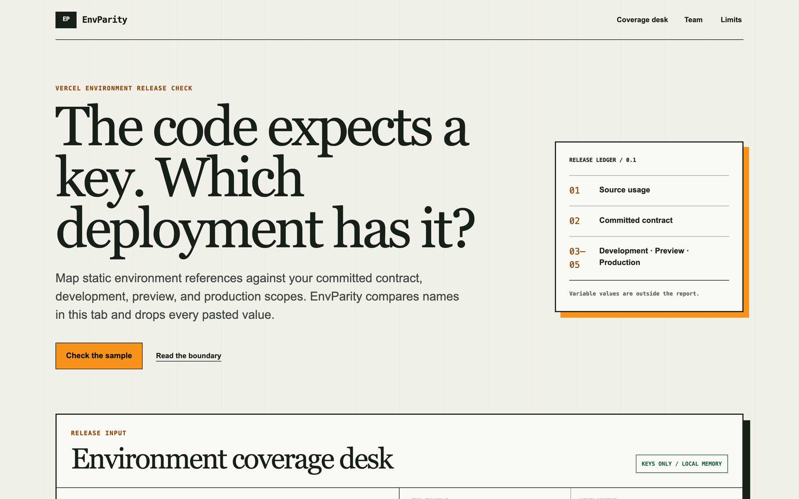

# EnvParity

EnvParity compares environment-variable references in source code with a committed contract and value-free development, preview, and production key lists. It reports missing scopes, undocumented usage, stale contract entries, and suspicious `NEXT_PUBLIC_` names, then generates a deterministic `env-parity.json` file containing key names only.

The product is for Next.js and Vercel teams reviewing configuration before release. The free workbench handles one source sample. Customers, completed payments, and revenue remain unverified.



## Local setup

Requirements: Node.js 20.9 or later and pnpm 11.

```bash
pnpm install
cp .env.example .env.local
pnpm dev
```

Open [http://localhost:3000](http://localhost:3000). The coverage workflow needs no environment variables. `NEXT_PUBLIC_TEAM_URL` can point to a real checkout when one exists; otherwise the Team action opens a pilot email. `NEXT_PUBLIC_PLAUSIBLE_DOMAIN` enables aggregate event delivery without source, key, or value properties.

## Supported accessors and checks

Static extraction covers `process.env.KEY`, bracket access with a literal key, `import.meta.env.KEY`, `Deno.env.get("KEY")`, and `Bun.env.KEY`.

- `ENV001`: a used key is absent from production.
- `ENV002`: a used key is absent from preview.
- `ENV003`: a used key is absent from development.
- `ENV004`: a used key is absent from the committed contract.
- `ENV005`: a browser-public key name contains a sensitive signal.
- `ENV006`: a contract key has no supported static source reference.

## Verification

```bash
pnpm format:check
pnpm lint
pnpm typecheck
pnpm test
pnpm build
pnpm audit --audit-level high
bash ./scripts/verify-signature.sh
```

`pnpm verify` runs the repository release gate. Tests cover every accessor, manifest value removal, every finding class, clean coverage, sorting, and value-free JSON generation.

## Monetization

The Team action reads `NEXT_PUBLIC_TEAM_URL`. When unset, it opens a pilot request email instead of presenting a fake checkout. Evidence and assumptions are recorded in [docs/OPPORTUNITY.md](docs/OPPORTUNITY.md).

## Privacy and limitations

- Inputs stay in browser memory. There is no ingestion route, account, or database.
- Manifest text after `=` is discarded before analysis and cannot enter reports or generated JSON.
- Computed keys, wrapper functions, framework-specific helpers, and minified bundles may be missed.
- Matching names does not verify values, permissions, secret rotation, branch overrides, or deployed behavior.
- Input size is bounded to 200,000 source characters and 75,000 characters per manifest.
- The `X-Built-By` header percent-encodes the canonical em dash because Node HTTP headers cannot carry U+2014 directly.
- No production deployment has been verified from this repository.

Requirements and threats are in [docs/SPEC.md](docs/SPEC.md).

---

Built by Uvin Vindula — [iamuvin.com](https://iamuvin.com)
